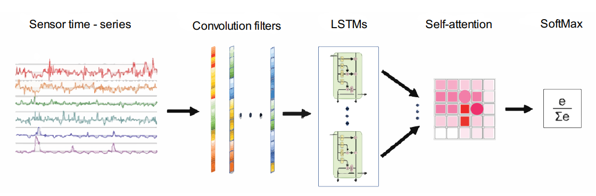
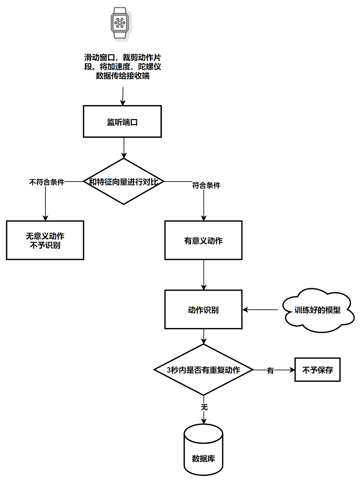

# 《基于智能手表的动作识别》

## （1）背景

​	此代码是学校《智能家居联合实验室》的第一阶段任务代码，主要是实现了基于智能可穿戴设备的人体动作识别，初步能识别的动作有：抽烟、喝水、站起、坐下、走路、扫地、拖地。共七种，训练样本总数为4835条。其中加入了第八种“未知”动作，主要截取的是抽烟和喝水动作中，手从面部下落的动作，这些归类成未知动作，不予识别。

## （2）原理

​	对于我们采集的动作片段，将其按照400 时间步长度处理成一个时间片段，即加速度传感器（采集频率为50Hz），其x轴数据长为400，y轴数据长为400，z轴数据长为400。陀螺仪数据（采集频率为50Hz），其x轴数据长为400，y轴数据长为400，z轴数据长为400。无数据的地方填0补充。最后汇总成一个400x6维的向量输入到模型中。

​	模型总体结构如下图所示：

​	

​	动作识别流程如下所示：

## （3）文件说明

​	data文件夹：里面主要包含训练样本集以及从模型中提取的一些高维空间特征，用于特征比对。11-09-acc.csv和11-16-acc.csv保存了训练样本集，其余的new开头的文件和old开头的文件均是高维动作特征。主要使用的是new_mean_320_all_feature.cxv

​	flask文件夹：主要是启动监听本机的一个端口，配合手表的动作采集。当手表截取到一个片段后发到指定监听的地址和端口，服务器收到数据后会执行上面“动作识别流程”这一套过程，最后得到结果。启动activityData.py即可监听。all_layer.py atten_layer.py 为模型结构，11_16_param.pkl为模型训练好的参数。connect_to_database.py为连接数据库操作。

​	smartHomeActivity文件夹:即为模型的训练。在train.py和train_with_grpo.py中

​	utils文件夹：里面主要是用于处理模型中间高纬特征的程序，也包含了降维、可视化程序。

​	phone文件夹：手表端Android APP，滑动窗口处理动作片段，发送到服务器。